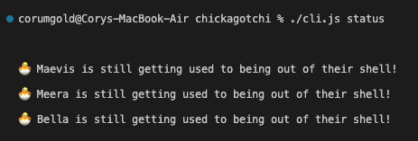

# Chickagotchi

## Background

I created this app so I could get some extra practice with what I have learned so far in Fullstack Academy's Junior Phase.

A few of the concepts that I will demonstrate in this project are:

- Database management using Sequelize and PostgreSQL.
- Node.js and the Express application framework.
- Basic HTML/CSS.

~~This file assumes a local PostgreSQL database called **'chickagotchi'**.~~ This app now uses SQLite so there is no need to create a local database. Please make sure to run `npm install` to download all dependencies! You can type `npm start` in your terminal to run the code.

If you are on the original main branch, you can view the app in your browser at [http://localhost:3000](http://localhost:3000). Alternatively, you can use the command line after running `npm start` to play the game if you are on the CLI branch.

## Version 2.0

- Added ability to play the game using the command line.
- The app no longer uses PostgreSQL and instead uses SQLite.

## Version 1.1 (Updated 8/16/2022)

- Moved CSS declarations into a LESS file.
- Added more greetings for each chicken emotion.
- Small style changes.
- Change views to be more concise (see source code).
- Added death functionality.

## List of Key Features at First Launch

- The ability to add any number of chickens to watch after.
- Emojis that update depending on a chicken's age (newborn, chick, adult).
- A fun "Tamagotchi" style interface.

