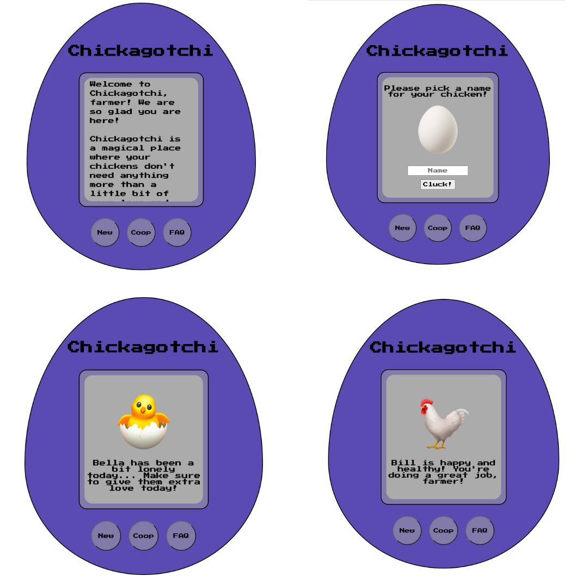

# chicken-or-egg-game

<h2>Background</h2>

I created this app so I could get some extra practice with what I have learned so far in Fullstack Academy's Junior Phase.

A few of the concepts that I will demonstrate in this project are:

<ul>
  <li>Database management using Sequalize and PostgreSQL.</li>
  <li>Node.Js and the Express application framework.</li>
  <li>Basic HTML/CSS.</li>
</ul>

This file assumes a local PostgreSQL database called <strong>'chickagotchi'</strong>. Please make sure to also 'npm install -y' to download all dependencies! The code is set up to send data to your browser at http://localhost:3000. You can type <code>npm start</code> in your terminal to run the code.

<h2>Version 1.1 (Updated 8/16/2022)</h2>
<ul>
  <li>Moved CSS declarations into a LESS file.</li>
  <li>Added more greetings for each chicken emotion.</li>
  <li>Small style changes.</li>
  <li>Change views to be more concise (see source code).</li>
  <li>Added death functionality.</li>
</ul>
<h2>List of Key Features at First Launch</h2>
<ul>
  <li>The ability to add any number of chickens to watch after.</li>
  <li>Emojis that update depending on a chicken's age (newborn, chick, adult)</li>
  <li>A fun "Tamogatchi" style interface.</li>
</ul>

